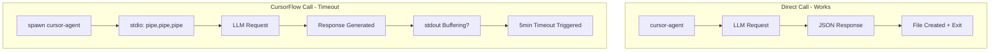

# CursorFlow Debugging and Improvement Plan

## Problem Summary

Testing revealed that `cursor-agent` works correctly when called directly (10-15 seconds response time), but times out when spawned by CursorFlow after 5 minutes. The file creation task actually succeeds in the worktree, but CursorFlow fails to capture the result.

## Root Cause Analysis




### Issue 1: stdout Buffering Problem (Critical)

- **Location**: [`node_modules/@litmers/cursorflow-orchestrator/src/core/runner.ts`](node_modules/@litmers/cursorflow-orchestrator/src/core/runner.ts) line 132-135
- **Problem**: CursorFlow uses `stdio: ['pipe', 'pipe', 'pipe']` which may cause stdout buffering issues
- **Evidence**: Direct cursor-agent calls output JSON immediately, but CursorFlow never receives it
- **Solution**: Test with `stdio: ['inherit', 'pipe', 'pipe'] `or use `stdbuf` to disable buffering

### Issue 2: Hardcoded 5-minute Timeout

- **Location**: [`node_modules/@litmers/cursorflow-orchestrator/src/core/runner.ts`](node_modules/@litmers/cursorflow-orchestrator/src/core/runner.ts) line 174-181
- **Problem**: 300000ms (5 min) timeout is hardcoded, not configurable
- **Solution**: Make timeout configurable via task JSON or environment variable

### Issue 3: Task Name Showing "undefined"

- **Location**: Terminal log shows `[1/1] undefined` instead of task name
- **Problem**: Task JSON structure has `id` field but CursorFlow may expect `name`
- **Current task file**: [`_cursorflow/tasks/simple-test/01-hello.json`](_cursorflow/tasks/simple-test/01-hello.json)
- **Solution**: Ensure task JSON has both `id` and `name` fields, or fix CursorFlow to read `id`

### Issue 4: Long Command Line Arguments

- **Problem**: The entire prompt (including dependency policy) is passed as a CLI argument
- **Evidence**: `ps aux` shows very long command line with the full prompt
- **Risk**: Shell argument length limits, escaping issues
- **Solution**: Use stdin to pass prompt instead of CLI argument

### Issue 5: Monitoring Visibility

- **Problem**: Difficult to see real-time progress during execution
- **Current state**: `terminal.log` only shows "Executing cursor-agent..." and nothing more
- **Solution**: Add heartbeat logging, progress indicators, and better error capture

## Proposed Fixes

### Fix 1: Create Local CursorFlow Patch (Immediate)

Create a patched version of the runner to test fixes before upstream PR:

```javascript
// scripts/patches/cursorflow-runner-patch.js
// Test different stdio configurations
const child = spawn('cursor-agent', args, {
  stdio: ['ignore', 'pipe', 'pipe'],  // Don't pipe stdin
  env: { ...process.env, PYTHONUNBUFFERED: '1', NODE_OPTIONS: '' },
});
```


### Fix 2: Add Configurable Timeout

Allow timeout configuration in task JSON:

```json
{
  "lane": "hello-test",
  "model": "gemini-3-flash",
  "timeout": 600000,  // 10 minutes
  "tasks": [...]
}
```


### Fix 3: Fix Task Name Display

Update task JSON to include explicit `name` field:

```json
{
  "tasks": [
    {
      "id": "create-hello",
      "name": "Create Hello File",  // Add this
      "prompt": "..."
    }
  ]
}
```


### Fix 4: Simplify Test Case

Create minimal test to isolate the issue:

```json
{
  "lane": "minimal-test",
  "model": "gemini-3-flash",
  "allowDependencyChange": false,
  "tasks": [
    {
      "id": "say-hello",
      "name": "Say Hello",
      "prompt": "Just respond with: Hello World"
    }
  ]
}
```


## Implementation Order

1. **Immediate**: Create minimal test case and run with verbose logging
2. **Short-term**: Patch CursorFlow runner locally to test stdio fixes
3. **Medium-term**: Submit PR to CursorFlow with configurable timeout
4. **Long-term**: Improve monitoring and error reporting

## Files to Create/Modify

| File | Action | Purpose ||------|--------|---------|| `_cursorflow/tasks/minimal-test/01-minimal.json` | Create | Minimal test case || `scripts/patches/test-cursor-agent.js` | Create | Direct spawn test || `scripts/patches/cursorflow-runner-patch.js` | Create | Patched runner |

## Success Criteria

1. CursorFlow completes simple task within 1 minute
2. JSON response from cursor-agent is captured in terminal.log