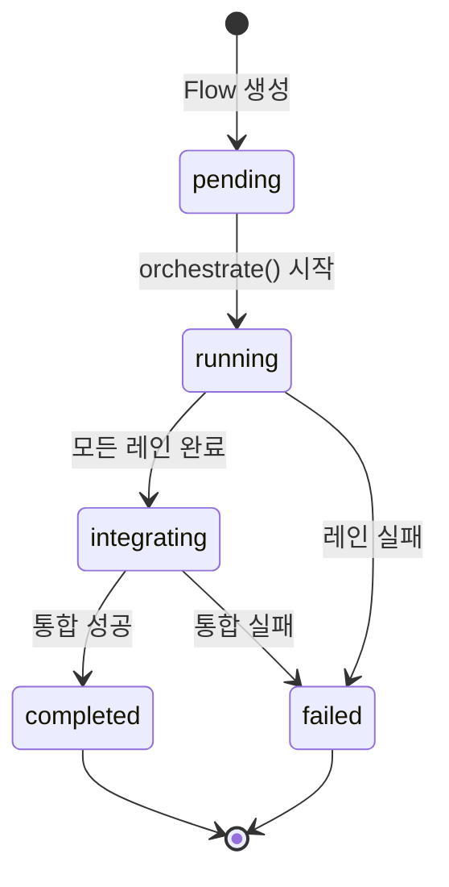
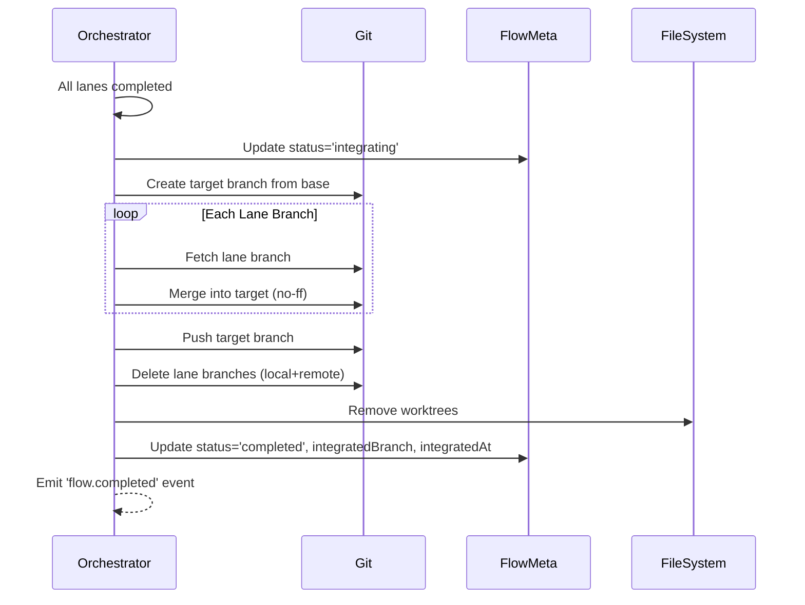

# ADR-0006: Flow 완료 시 자동 통합 및 정리

## 상태
채택됨 (Accepted)

## 컨텍스트

CursorFlow는 여러 레인(Lane)을 병렬로 실행하여 각각 독립된 Git 워크트리에서 작업을 수행합니다. 각 레인은 자체 파이프라인 브랜치를 가지며, 작업 완료 시 해당 브랜치에 결과를 커밋합니다.

문제점:
1. 모든 레인이 성공적으로 완료되어도, 사용자가 수동으로 각 레인의 브랜치를 병합해야 함
2. 임시로 생성된 파이프라인 브랜치와 워크트리가 자동으로 정리되지 않음
3. Flow 레벨의 상태(`FlowMeta.status`)가 orchestration 결과와 동기화되지 않음

## 결정

**Flow Run이 성공적으로 완료되면 자동으로 다음을 수행한다:**

1. **자동 통합 (Auto-Integration)**
   - 모든 레인의 파이프라인 브랜치를 하나의 `feature/{FlowName}-integrated` 브랜치로 병합
   - 병합은 base branch에서 시작하여 각 레인 브랜치를 순차적으로 no-ff merge

2. **자동 정리 (Auto-Cleanup)**
   - 병합 완료 후 임시 레인 브랜치들(local + remote) 삭제
   - 워크트리 디렉토리 삭제
   - Git worktree 레지스트리에서 제거

3. **상태 관리 (State Management)**
   - `FlowMeta`에 통합 결과 저장:
     - `status: 'completed'`
     - `integratedBranch: string`
     - `integratedAt: string` (ISO timestamp)
   - 실패 시 `status: 'failed'`와 에러 정보 저장

4. **수동 명령어 유지**
   - `cursorflow complete` 명령어는 수동 복구용으로 유지
   - 자동 통합 실패 시 또는 옵션으로 비활성화된 경우에 사용

## 구현 상세

### Orchestrator 완료 시점 수정

```typescript
// orchestrate() 함수의 성공 완료 시점
if (completedLanes.size === lanes.length && failedLanes.size === 0) {
  // Flow 완료 자동 통합
  await finalizeFlow({
    tasksDir,
    runId,
    runRoot,
    laneBranches: laneWorktreeDirs,
    pipelineBranch,
    repoRoot,
    laneRunDirs,
    noCleanup: options.noCleanup,
  });
}
```

### 상태 전이 다이어그램



### Flow Completion Workflow



## 결과

### 긍정적 영향
- 사용자 경험 향상: 수동 병합 작업 불필요
- 리소스 자동 정리: 임시 브랜치/워크트리 누적 방지
- 상태 일관성: FlowMeta가 실제 실행 결과를 반영
- 감사 가능성: 통합 시점과 브랜치 정보 기록

### 고려 사항
- 병합 충돌 시 자동 통합 실패 → 수동 `complete` 명령어로 해결
- `--no-cleanup` 옵션으로 정리 비활성화 가능
- 통합 브랜치 이름 커스터마이징 가능

## 대안 고려

1. **별도 커맨드로만 제공** (기각)
   - 사용자가 항상 수동으로 실행해야 함
   - 잊어버리면 임시 리소스가 계속 누적

2. **Webhook/Event 기반 외부 트리거** (기각)
   - 추가 설정 복잡성
   - 내부에서 처리 가능한 작업을 외부화할 이유 없음

## 관련 문서
- [ARCHITECTURE.md](../ARCHITECTURE.md) - Section 1: Git-isolated Parallel Workflow
- [MODULE_GUIDE.md](../MODULE_GUIDE.md) - GitPipelineCoordinator

