# CursorFlow Architecture Documentation

This document explores the architectural complexities of CursorFlow, focusing on the non-trivial solutions designed to handle parallel AI agent orchestration, filesystem isolation, and robust error recovery.

> 📚 **Note**: For detailed records of individual design choices and their rationales, please refer to our **[Architecture Decision Records (ADRs)](./ADR/README.md)**.

---

## 0. High-level Core Workflow

The Orchestrator manages the lifecycle of multiple parallel Lanes. It handles scheduling, dependency resolution, stall detection, and overall coordination.

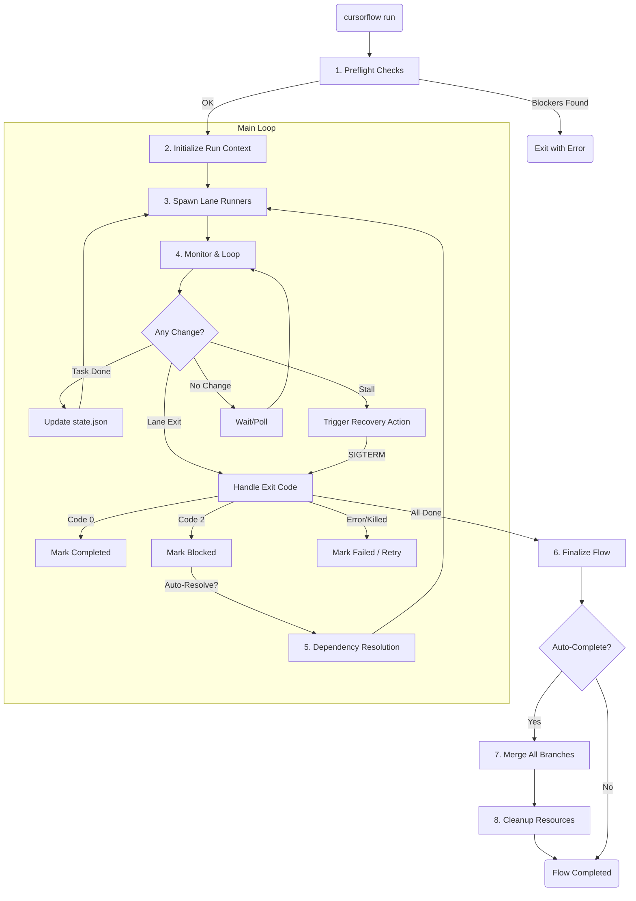

---

## 1. Git-isolated Parallel Workflow

### Architectural Problem
When multiple AI agents work on the same repository concurrently, they inevitably conflict if they share the same working directory (e.g., modifying the same files, competing for the `.git/index` lock, or overwriting each other's uncommitted changes). Traditional branching is insufficient because AI agents require a physical filesystem to run tests and linters.

### Why it is Non-trivial
Standard Git operations assume a single working tree per repository. Supporting $N$ parallel agents requires $N$ isolated working trees that are still part of the same logical repository, enabling them to share history and eventually merge their work without manual intervention.

### Chosen Structure and Rationale
CursorFlow uses **Git Worktrees** via the `GitLifecycleManager`. Each "Lane" is assigned a dedicated worktree directory outside the main repository. This provides:
- **Physical Isolation**: Each agent has its own `node_modules`, build artifacts, and modified source files.
- **Shared History**: All worktrees share the same `.git` directory, allowing for seamless cross-branching and merging.
- **Automated Lifecycle & Change Management**: The `GitLifecycleManager` handles the setup (`ensureWorktree`), task-specific branching (`checkoutBranch`), and the multi-step finalization.
    - **Uncommitted Changes**: Before merging or finishing a task, the system automatically detects uncommitted changes (`git status`). If found, it performs an atomic `git add -A` and `git commit` to ensure no work is lost.
### Runner Internal Process

Inside each Lane Runner (child process), tasks are executed sequentially with atomic checkpoints and git operations.

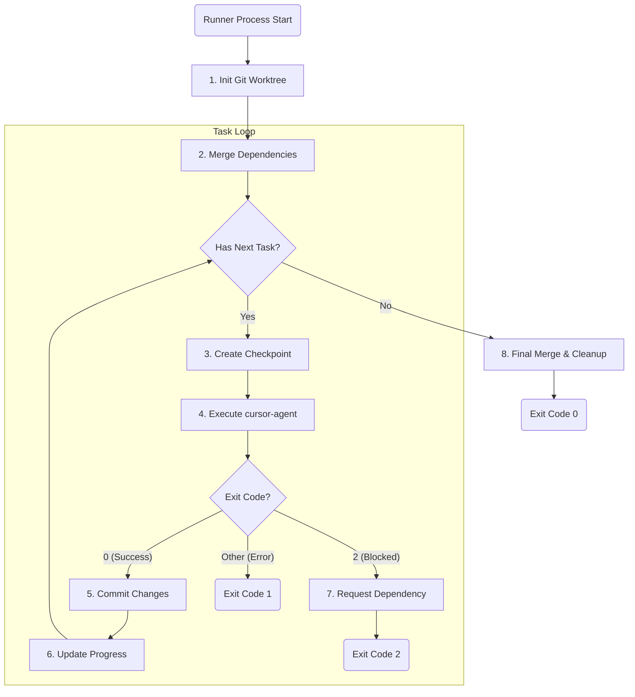

---

## 2. Distributed State Coordination

### Architectural Problem
CursorFlow operates as a distributed system across multiple OS processes: the **Orchestrator** (parent) and multiple **Lane Runners** (children). Synchronizing the state of a Lane (e.g., "Initializing" -> "Running" -> "Waiting on Dependency") in real-time while ensuring durability across crashes is a significant challenge.

### Why it is Non-trivial
Direct IPC (Inter-Process Communication) is volatile; if a process crashes, the state is lost. Conversely, relying solely on polling the filesystem is slow and lacks the event-driven responsiveness needed for complex coordination (like dependency resolution).

### Chosen Structure and Rationale
CursorFlow implements a hybrid approach using a **State Machine** for durability and an **Event Bus** for real-time coordination.
- **LaneStateMachine**: Acts as the single source of truth for a lane's life. Every transition (e.g., `StateTransitionTrigger.START`) is validated against a predefined state graph and persisted to `state.json`.
- **EventRegistry**: A typed, cross-module event bus. When a `LaneStateMachine` transitions, it emits a `LANE_STARTED` or `LANE_COMPLETED` event. The Orchestrator and other lanes subscribe to these events to trigger dependent actions immediately.

### Coordination Diagram

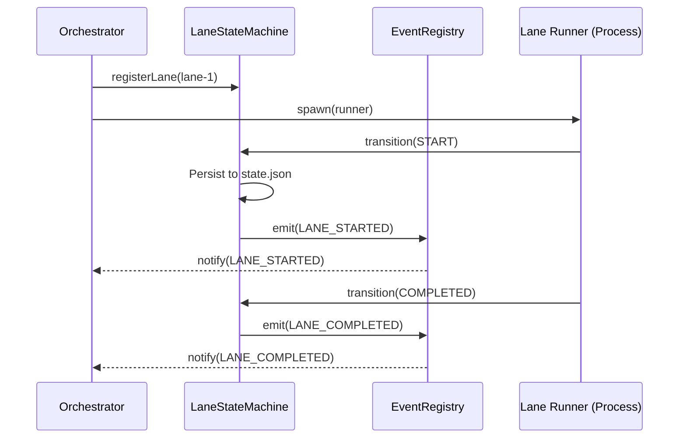

### Primary State Machine

The Lane lifecycle is governed by a state machine that ensures valid transitions and persistence to `state.json`.

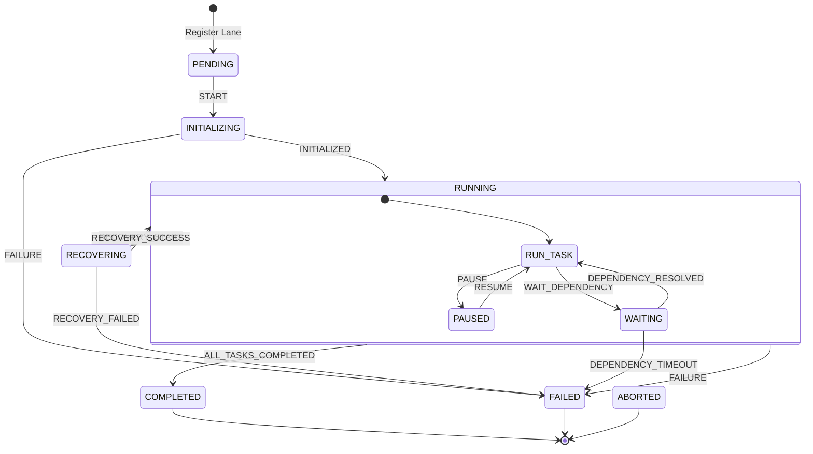

### Sub-State Hierarchy (within RUNNING)

While in the **RUNNING** primary state, a lane cycles through various sub-states for fine-grained monitoring.

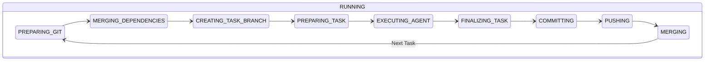

---

## 3. Multi-tiered Stall Recovery

### Architectural Problem
AI agents (like `cursor-agent`) can "stall" without exiting. They might be stuck in an infinite loop, waiting for a prompt that never arrived, or experiencing a silent API failure. Simply timing out and killing the process is wasteful and often loses context.

### Why it is Non-trivial
Detection requires differentiating between a "heavy computation" (e.g., `npm install`) and a "dead stall." Recovery must be progressive: we shouldn't restart an agent if a simple "Please continue" message could fix the issue.

### Chosen Structure and Rationale
The `StallDetectionService` implements a **multi-tiered heuristic monitor**:
1. **Liveness Signals**: It monitors both `stdout` activity (immediate liveness) and `state.json` updates (progress liveness).
2. **Phase-based Escalation**:
    - **Phase 1 (Continue)**: After 2 mins of silence, send a `CONTINUE_SIGNAL`.
    - **Phase 2 (Stronger Prompt)**: If still silent, send a more assertive `STRONGER_PROMPT`.
    - **Phase 3 (Restart)**: If all fails, kill the process and `resume` the session.
3. **Heartbeat Awareness**: It ignores "heartbeat" messages that don't represent actual task progress.

### Recovery State Machine

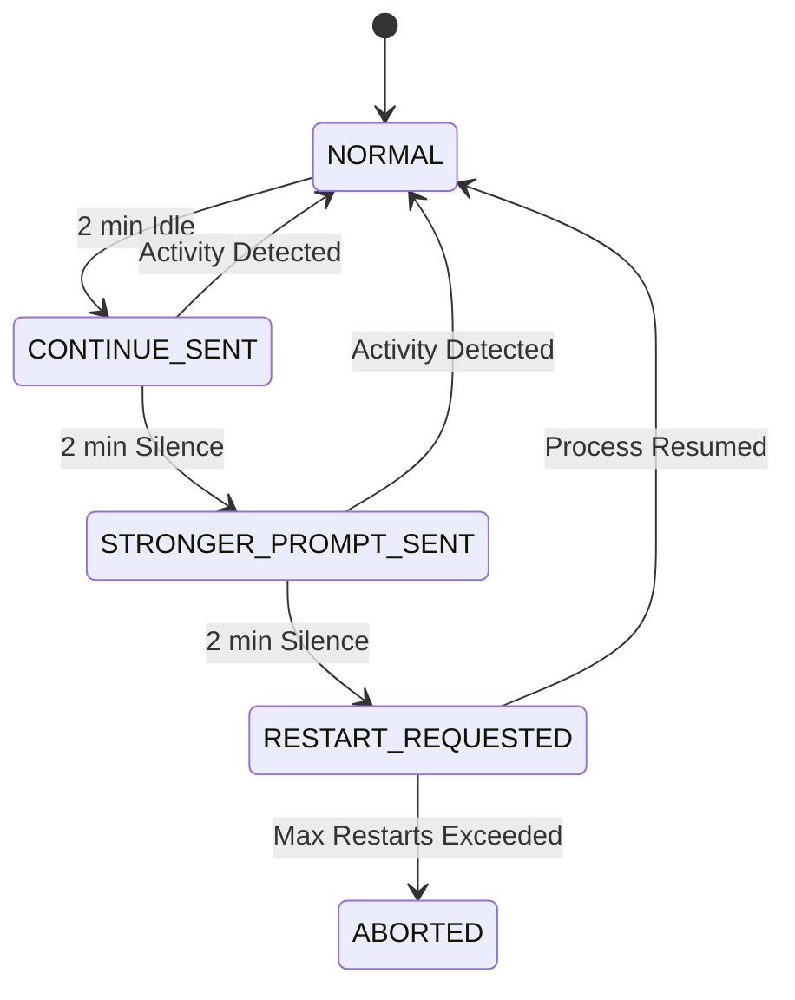

---

## 4. Inter-process Intervention Bridge

### Architectural Problem
Once an AI agent is running in an isolated Lane Runner process, there is no direct way to "talk" to it. The agent reads from its own stdin, which is not easily accessible from the Orchestrator or a separate CLI command (like `cursorflow signal`).

### Why it is Non-trivial
Standard UNIX signals (like `SIGUSR1`) carry no data. We need to pass complex instructions (like "Stop what you are doing and fix this merge conflict") to an agent that is already executing a long-running task.

### Chosen Structure and Rationale
CursorFlow uses the **"Kill-and-Resume" Bridge** pattern implemented in `InterventionExecutor`:
1. **Mailbox**: The intervention request (type, message) is written to a `pending-intervention.json` file in the lane's directory.
2. **Signal**: The Orchestrator/Runner sends a `SIGTERM` to the active `cursor-agent` process.
3. **Resumption**: The Runner detects the process exit, checks the mailbox, and if an intervention is pending, it restarts the agent with the `--resume` flag, injecting the intervention message as the first prompt of the new session.

### Intervention Sequence

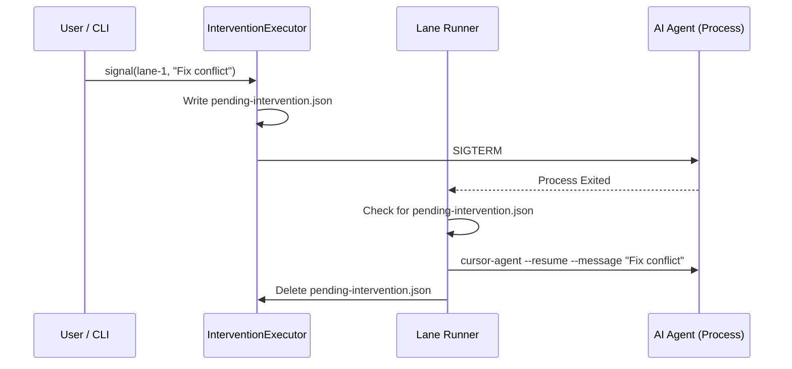

---

## 5. Cross-Lane Dependency Resolution

### Architectural Problem
Complex workflows require strict execution ordering (e.g., "Lane B's Task 1 must wait until Lane A's Task 2 is finished"). Managing these dependencies across parallel processes without creating deadlocks is critical.

### Why it is Non-trivial
Dependencies can be circular (which must be detected before start) and are often fine-grained (task-level rather than lane-level). Waiting must be non-blocking for the Orchestrator but blocking for the specific Lane Runner.

### Chosen Structure and Rationale
1. **DAG Modeling**: Before execution, all tasks are modeled as a Directed Acyclic Graph.
2. **Cycle Detection**: Using **Kahn's Algorithm** and DFS, CursorFlow detects circular dependencies during the `preflight-check`.
3. **Reactive Waiting**: Instead of the Orchestrator scheduling everything, individual Lane Runners use `waitForTaskDependencies`. They poll the `state.json` of their dependencies. This decentralized approach is more resilient to individual runner crashes.

### Dependency Flow

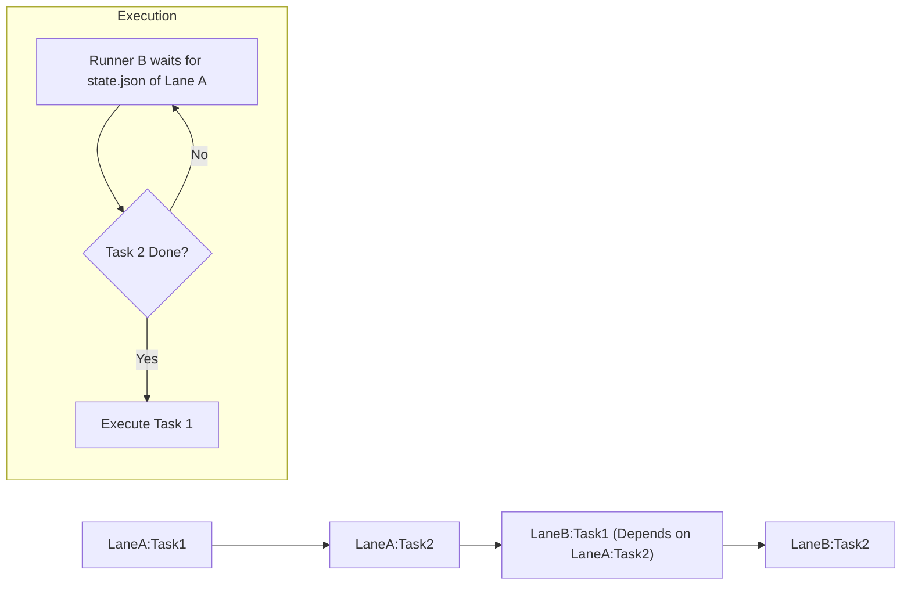

---

## 6. AI-Aware Failure Policy & Circuit Breaker

### Architectural Problem
AI agents fail in ways traditional software doesn't: rate limits, context window exhaustion, "hallucinated" git commands, or simple confusion. Treating all non-zero exit codes as "fatal" leads to brittle workflows.

### Why it is Non-trivial
We must distinguish between **Transient Failures** (e.g., Network, Rate Limit) which should be retried with backoff, and **Logic Failures** (e.g., Auth Error, Merge Conflict) which require human or specialized AI intervention.

### Chosen Structure and Rationale
The `FailurePolicy` acts as a **Taxonomy Engine** and **Circuit Breaker**:
- **Categorization**: It maps raw error strings and exit codes to `FailureType` (e.g., `GIT_PUSH_REJECTED`, `AGENT_RATE_LIMIT`).
- **Policy Mapping**: Each `FailureType` is mapped to a `RecoveryAction`. For example, a `MERGE_CONFLICT` triggers `SEND_GIT_GUIDANCE` (via the Intervention Bridge), while a `NETWORK_ERROR` triggers an exponential backoff retry.
- **Circuit Breaker**: To prevent runaway API costs, the circuit breaker opens if transient failures occur too frequently, pausing the lane until a cooldown period or manual reset.

### Failure Handling Logic

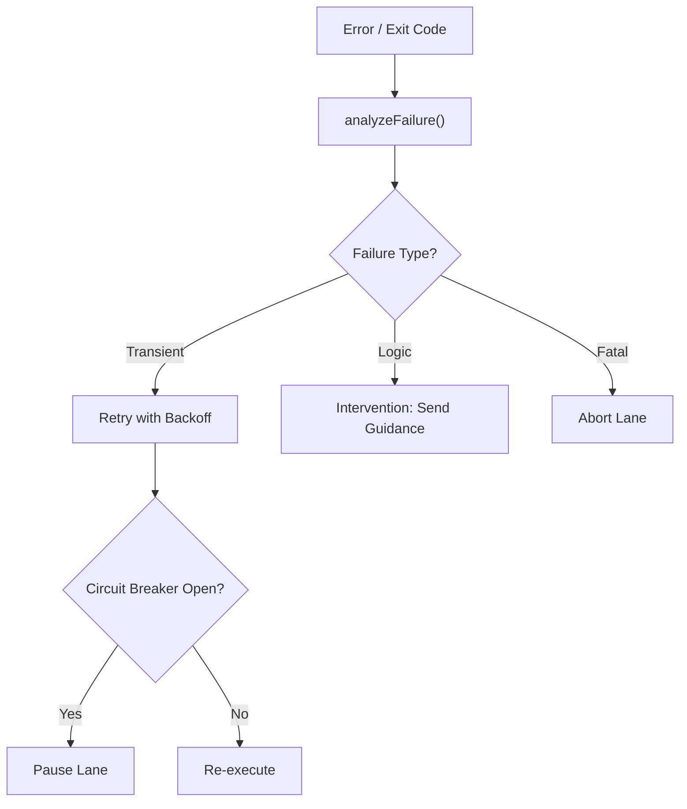

---

## 7. Distributed Health & Preflight Verification

### Architectural Problem
Parallel orchestration is resource-intensive and relies on multiple external binaries (`git`, `cursor-agent`). Starting a long-running workflow only to have it fail 5 minutes later due to an expired session or low disk space is a major UX and cost failure.

### Why it is Non-trivial
Checks must be non-blocking but exhaustive. They cover multiple domains: filesystem (locks, disk), network (Git remotes), authentication (Cursor cloud), and process environment (agent responsiveness). The system must differentiate between "Blockers" (cannot start) and "Warnings" (start with caution).

### Chosen Structure and Rationale
CursorFlow uses a **Preflight Gate** pattern. Before any lanes are spawned, the `runHealthCheck` service executes a suite of parallel probes. The results are aggregated into a `SystemHealth` report. This ensures that the environment is "known-good" at $T_0$, significantly reducing the likelihood of early-stage failures.

### Preflight Gate Logic

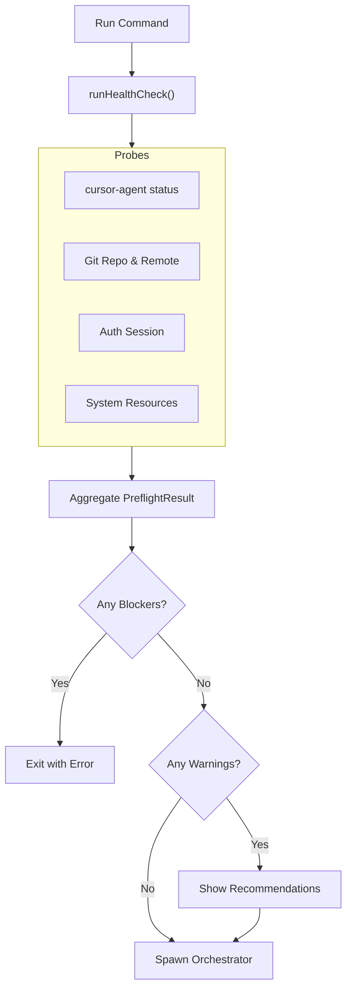

---

## 8. Atomic Checkpoint & Git Recovery Bridge

### Architectural Problem
AI workflows are long-running and prone to interruption (system crash, manual stop, stall recovery). Resuming from a failed state without re-executing expensive tasks requires an atomic snapshot of both the "Logical Progress" (which tasks are done) and the "Physical Workspace" (modified files).

### Why it is Non-trivial
Logical state is in memory/JSON, while physical state is on the disk (Git). These can drift. A naive resume might start Task 3 thinking Task 2 is done, but the files Task 3 needs might have been lost or not committed.

### Chosen Structure and Rationale
The `CheckpointSystem` implements a **State-Git Bridge**:
- **Atomic Snapshots**: When a checkpoint is created, it captures the `LaneState` (JSON) and the current Git commit hash.
- **Auto-Checkpoints**: Critical operations are wrapped in `withAutoCheckpoint` decorators, ensuring a recovery point exists before the mutation begins.
- **In-place Recovery**: During `restoreFromCheckpoint`, the system first checks out the correct Git commit and then restores the `state.json`.
- **Dirty State Protection**: If uncommitted changes exist during a recovery attempt, the system automatically stashes them (`git stash`) to prevent data loss while ensuring the workspace can be reset to the checkpoint's known-good state.

### Recovery Flow

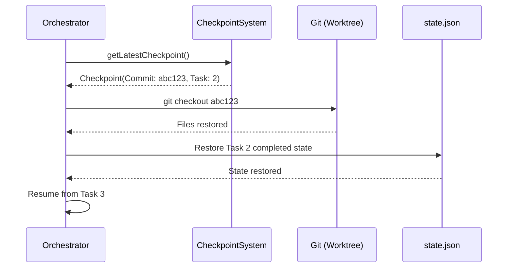

---

## 9. Cross-process Log Streaming & ANSI Multiplexer

### Architectural Problem
Monitoring $N$ parallel lanes in a single terminal is impossible if their outputs are mixed. Each agent produces high-volume, ANSI-formatted text (colors, progress bars) that can corrupt a shared stream if interleaved.

### Why it is Non-trivial
We need "Split View" (individual lane logs) and "Unified View" (all events in order) simultaneously. Writing raw ANSI to files makes them unreadable for search tools, but stripping it from the terminal makes them unreadable for humans.

### Chosen Structure and Rationale
CursorFlow implements an **Enhanced Log Manager** for each lane:
- **Parallel Buffering**: Each lane has its own buffer to prevent cross-process line tearing.
- **Dual Output**: The manager produces a "Raw" log (with ANSI for terminal streaming) and a "Clean" log (stripped ANSI, with timestamps) for persistent storage.
- **Global Multiplexer**: The Orchestrator acts as a multiplexer, subscribing to lane events and printing them to the main console using a consistent prefixing scheme.

### Log Distribution Flow

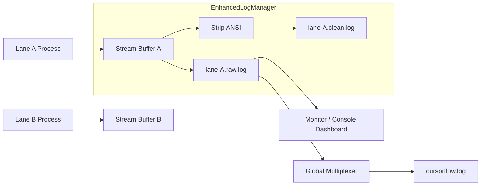

---

## 10. Flow Auto-Completion & Resource Cleanup

### Architectural Problem
When all lanes complete successfully, the user faces a manual burden: merging each lane's pipeline branch into a unified feature branch, deleting temporary branches, and removing worktree directories. This manual process is error-prone and creates resource accumulation if forgotten.

### Why it is Non-trivial
Automatic completion must handle merge conflicts gracefully, maintain audit trails (which branches were merged), and ensure atomic cleanup (if the merge fails, don't delete resources). The state of the Flow must be persisted so that users can see the final result even after the orchestrator exits.

### Chosen Structure and Rationale
CursorFlow implements **Automatic Flow Completion** in the Orchestrator:
- **Automatic Integration**: When all lanes succeed, the system creates a `feature/{FlowName}-integrated` branch from the base branch and merges all lane pipeline branches sequentially.
- **State Persistence**: The `FlowMeta` (stored in `flow.meta.json`) tracks the flow status (`pending` → `running` → `integrating` → `completed`) and the final integrated branch name.
- **Atomic Cleanup**: Only after successful merge and push, temporary resources (lane branches, worktrees) are deleted.
- **Fallback**: If auto-completion fails (e.g., merge conflict), the flow is marked as `failed` and `cursorflow complete` can be used manually after resolving issues.

### Flow Completion Sequence

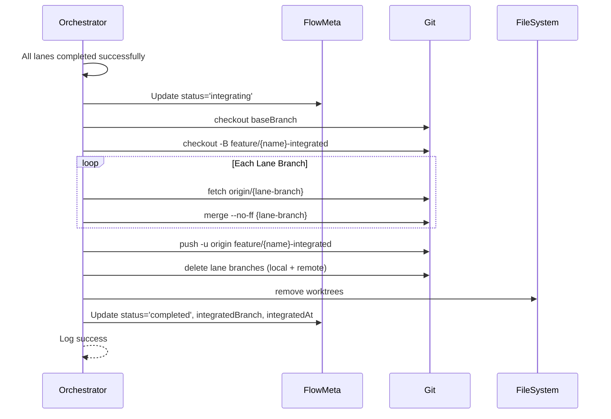

### Related ADR
- [ADR-0006: Flow 완료 시 자동 통합 및 정리](./ADR/0006-auto-flow-completion-on-success.md)
